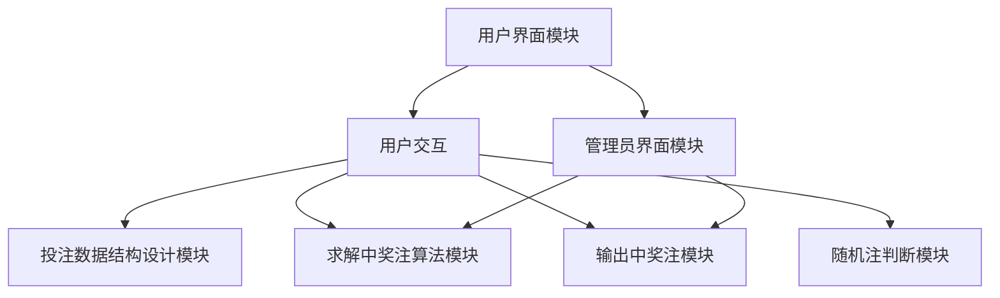
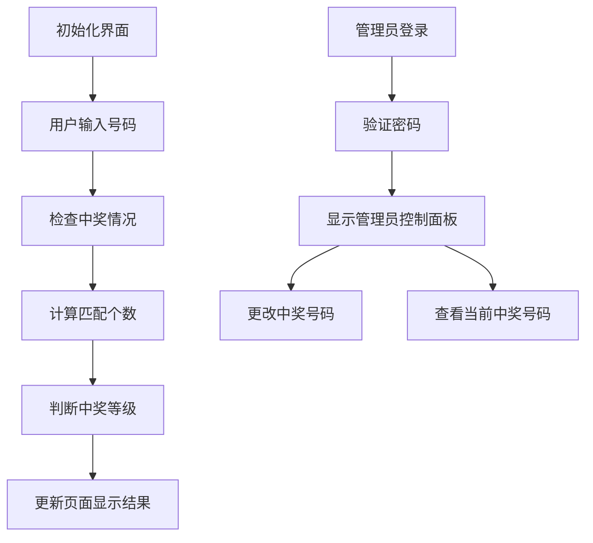
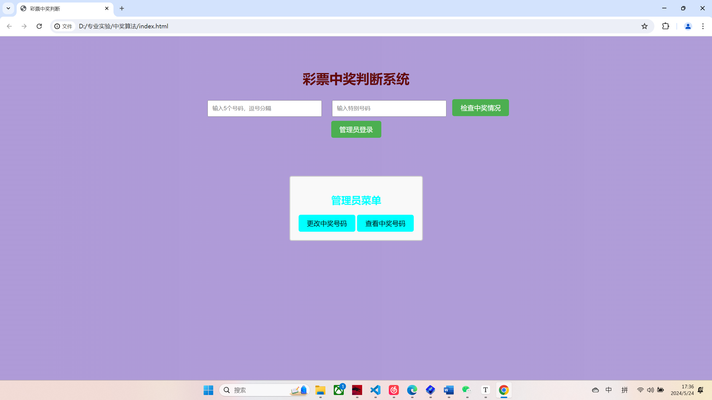
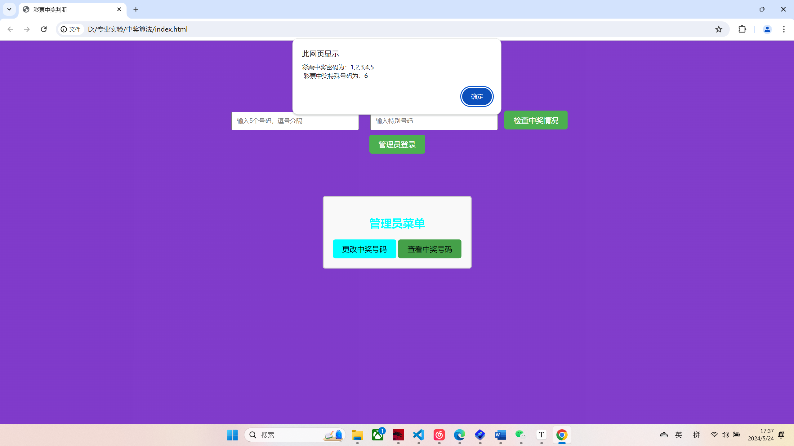

# 实验报告：兑奖算法

## 一、概述 

### 设计的任务和需要的知识点

本次实验的设计任务是实现一个彩票兑奖判断系统，能够根据用户输入的号码和特别号码，判断是否中奖以及所中的奖项。具体任务包括：
1. **设计投注的数据结构**：设计适合存储用户投注数据和中奖号码的数据结构。
2. **设计投注方式**：实现通过键盘输入或者从文件输入投注号码的方式。
3. **设计求解中奖注的算法**：实现判断用户投注号码是否中奖的算法。
4. **输出中奖注**：将中奖结果输出给用户。
5. **判断随机注是否中奖**：实现输入随机注后，判断是否中奖以及所中的奖项。

为完成这些任务，需要掌握以下知识点和技术：
- **DOM 操作**：用于获取用户输入和更新页面内容。
- **事件处理**：用于处理用户交互操作。
- **LocalStorage**：用于存储和读取中奖号码。
- **算法设计**：用于实现判断用户中奖的逻辑。

### 具体完成的设计内容

本实验主要完成了以下功能模块：

1. **用户界面模块**：
   - **规模**：负责显示输入框、按钮和结果区域。
   - **实现**：通过 DOM 操作和样式控制构建界面，提供用户输入和显示结果的区域。
   - **创新点**：通过 CSS 动画增加了动态背景效果，使界面更加美观。

2. **投注数据结构设计模块**：
   - **规模**：设计适合存储用户投注数据和中奖号码的数据结构。
   - **实现**：使用数组和字符串存储用户输入的号码和特别号码。

3. **求解中奖注算法模块**：
   - **规模**：实现判断用户投注号码是否中奖的算法。
   - **实现**：通过循环和条件判断，实现判断用户投注号码是否符合大奖、一等奖、二等奖、三等奖、四等奖和五等奖的条件。
   - **创新点**：使用 LocalStorage 存储和读取中奖号码，实现了数据的持久化。

4. **输出中奖注模块**：
   - **规模**：将中奖结果输出给用户。
   - **实现**：通过 DOM 操作更新页面内容，将中奖结果显示在结果区域。

5. **随机注判断模块**：
   - **规模**：实现输入随机注后，判断是否中奖以及所中的奖项。
   - **实现**：获取用户输入的随机号码，通过求解中奖注算法判断是否中奖，并将结果显示给用户。

6. **管理员界面模块**：
   - **规模**：提供管理员更改中奖号码和查看中奖号码的功能。
   - **实现**：通过管理员登录验证，显示管理员控制面板，允许管理员更改和查看中奖号码。
   - **创新点**：增加了管理员登录验证和控制面板功能，确保只有授权人员可以更改中奖号码。

## 二、总体设计

根据需求，本软件系统的整体设计思路是通过模块化设计和分层实现来确保功能的完整性和扩展性。

### 软件结构设计

整个软件系统可以分为以下几个主要模块：
1. **用户界面模块**：负责显示输入框、按钮和结果区域，处理用户的输入操作。
2. **投注数据结构设计模块**：设计适合存储用户投注数据和中奖号码的数据结构。
3. **求解中奖注算法模块**：实现判断用户投注号码是否中奖的算法。
4. **输出中奖注模块**：将中奖结果输出给用户。
5. **随机注判断模块**：实现输入随机注后，判断是否中奖以及所中的奖项。
6. **管理员界面模块**：提供管理员更改中奖号码和查看中奖号码的功能。

#### 模块结构图



#### 模块功能说明

1. **用户界面模块**：
   - **功能**：提供用户交互界面，显示输入框、按钮和结果区域，处理用户的输入操作。
   - **实现**：通过 DOM 操作和样式控制构建界面，提供用户输入和显示结果的区域。
   - **元素**：包括输入框、按钮、结果显示区域等。

2. **投注数据结构设计模块**：
   - **功能**：设计适合存储用户投注数据和中奖号码的数据结构。
   - **实现**：使用数组和字符串存储用户输入的号码和特别号码，使用 LocalStorage 存储和读取中奖号码。

3. **求解中奖注算法模块**：
   - **功能**：实现判断用户投注号码是否中奖的算法。
   - **实现**：通过循环和条件判断，实现判断用户投注号码是否符合大奖、一等奖、二等奖、三等奖、四等奖和五等奖的条件。

4. **输出中奖注模块**：
   - **功能**：将中奖结果输出给用户。
   - **实现**：通过 DOM 操作更新页面内容，将中奖结果显示在结果区域。

5. **随机注判断模块**：
   - **功能**：实现输入随机注后，判断是否中奖以及所中的奖项。
   - **实现**：获取用户输入的随机号码，通过求解中奖注算法判断是否中奖，并将结果显示给用户。

6. **管理员界面模块**：
   - **功能**：提供管理员更改中奖号码和查看中奖号码的功能。
   - **实现**：通过管理员登录验证，显示管理员控制面板，允许管理员更改和查看中奖号码。

### 数据结构设计

在系统中，主要采用了以下数据结构和变量：

1. **文件**：
   - `index.html`: 包含用户界面和管理员界面的基本结构和布局。
   - `styles.css`: 定义页面的样式和背景动画效果。
   - `script.js`: 实现用户交互、求解中奖注算法、输出中奖结果和管理员功能。

2. **全局变量**：
   - `winningNumbers`: 存储中奖号码的数组。
   - `winningSpecialNumber`: 存储中奖特别号码的变量。
   - `userNumbers`: 存储用户输入的投注号码的数组。
   - `userSpecialNumber`: 存储用户输入的特别号码的变量。
   - `matchedNumbers`: 存储用户投注号码与中奖号码匹配个数的变量。

这些数据结构和变量在系统中承担了不同的功能，确保了各个模块之间的协调工作和数据共享。例如，全局变量 `winningNumbers` 和 `winningSpecialNumber` 用于存储和读取中奖号码，`userNumbers` 和 `userSpecialNumber` 用于存储用户输入的投注号码，`matchedNumbers` 用于计算匹配的号码个数。

## 三、详细设计及实现

### 1. 模块的算法和数据结构

#### 用户界面模块

- **算法**：
  - 初始化界面，显示输入框和按钮。
  - 获取用户输入的投注号码和特别号码。
  - 将用户输入的数据传递给求解中奖注算法模块。
- **数据结构**：
  - `userNumbers`：数组，存储用户输入的5个投注号码。
  - `userSpecialNumber`：变量，存储用户输入的特别号码。

#### 投注数据结构设计模块

- **算法**：
  - 设计适合存储用户投注数据和中奖号码的数据结构。
  - 使用数组存储用户输入的号码和特别号码，使用 LocalStorage 存储和读取中奖号码。
- **数据结构**：
  - `winningNumbers`：数组，存储中奖号码。
  - `winningSpecialNumber`：变量，存储中奖特别号码。

#### 求解中奖注算法模块

- **算法**：
  - 获取用户输入的号码和特别号码，以及存储的中奖号码和特别号码。
  - 通过循环和条件判断，计算用户投注号码与中奖号码的匹配个数。
  - 判断用户投注号码是否符合大奖、一等奖、二等奖、三等奖、四等奖和五等奖的条件。
- **数据结构**：
  - `matchedNumbers`：变量，存储用户投注号码与中奖号码匹配个数。

#### 输出中奖注模块

- **算法**：
  - 根据求解中奖注算法模块的判断结果，生成对应的中奖信息。
  - 更新页面内容，将中奖结果显示在结果区域。
- **数据结构**：
  - `resultText`：字符串，存储中奖结果信息。

#### 随机注判断模块

- **算法**：
  - 获取用户输入的随机号码。
  - 通过求解中奖注算法判断是否中奖，并将结果显示给用户。
- **数据结构**：
  - 与求解中奖注算法模块相同。

#### 管理员界面模块

- **算法**：
  - 验证管理员密码，显示管理员控制面板。
  - 管理员可以更改中奖号码和查看当前中奖号码。
- **数据结构**：
  -

 `winningNumbers`：数组，存储管理员输入的中奖号码。
  - `winningSpecialNumber`：变量，存储管理员输入的特别号码。

### 2. 流程图和运行界面抓图

#### 流程图



#### 运行界面抓图和描述

1. **初始化界面**
   - 在 `index.html` 中创建输入框和按钮。
   - 页面加载时，显示彩票中奖判断系统的标题和输入区域。

2. **用户输入号码**
   - 用户在输入框中输入5个投注号码和特别号码。
   - 点击“检查中奖情况”按钮，将输入的号码传递给求解中奖注算法模块。

3. **检查中奖情况**
   - 在 `script.js` 中实现 `check()` 函数。
   - 获取用户输入的号码和特别号码，与存储的中奖号码进行比对。

4. **计算匹配个数**
   - 通过循环遍历用户输入的号码和中奖号码，计算匹配的个数。

5. **判断中奖等级**
   - 根据匹配个数和特别号码，判断用户所中的奖项（大奖、一至五等奖）。

6. **更新页面显示结果**
   - 根据判断结果，生成对应的中奖信息。
   - 更新页面内容，将中奖结果显示在结果区域。


7. **管理员登录**
   - 用户点击“管理员登录”按钮，输入管理员密码。
   - 通过 `showAdminLogin()` 函数验证密码，显示管理员控制面板。


8. **更改中奖号码**
   - 管理员在控制面板中输入新的中奖号码和特别号码。
   - 通过 `changeLotteryPassword()` 函数更新中奖号码，并存储到 LocalStorage。

9. **查看当前中奖号码**
   - 管理员在控制面板中点击“查看中奖号码”按钮。
   - 通过 `showAllWinningNumbers()` 函数显示当前存储的中奖号码和特别号码。

### 3. 编译和链接时的错误及解决方法

在设计和实现模块时，遇到了一些编译和链接错误，主要包括：

1. **输入数据格式错误**
   - **错误**：用户输入的号码格式不正确，导致无法正确解析。
   - **解决方法**：在获取用户输入时，添加格式检查，确保输入为有效的数字，并以逗号分隔。

2. **LocalStorage 数据读取错误**
   - **错误**：从 LocalStorage 读取中奖号码时，出现数据格式不正确的问题。
   - **解决方法**：在存储和读取数据时，使用 JSON 序列化和反序列化方法，确保数据格式正确。

3. **页面更新延迟**
   - **错误**：在更新页面内容时，出现延迟，导致用户体验不佳。
   - **解决方法**：优化 DOM 操作，减少不必要的重绘，提高页面更新效率。

通过以上调试和修正，最终实现了一个功能完整、运行稳定的彩票中奖判断系统。

## 四、结论

### 达到的要求

本次设计的彩票中奖判断系统成功实现了设计题目的所有要求，包括：

1. **设计投注的数据结构**：使用数组和字符串存储用户投注数据和中奖号码，结构合理，易于管理。
2. **设计投注方式**：通过键盘输入方式输入投注号码，界面简单明了，用户操作方便。
3. **设计求解中奖注的算法**：实现了判断用户投注号码是否中奖的算法，能够准确判断中奖等级。
4. **输出中奖注**：能够将中奖的号码输出给用户，并在页面上显示。
5. **判断随机注是否中奖**：能够判断随机输入的号码是否中奖，并给出详细的中奖等级信息。

### 功能特点

本程序具有以下特点：
1. **用户界面友好**：界面设计简洁直观，用户可以方便地输入号码和查看中奖结果。
2. **管理员功能**：增加了管理员界面，管理员可以更改和查看当前的中奖号码，确保系统的灵活性和安全性。
3. **数据持久化**：使用 LocalStorage 存储和读取中奖号码，保证数据的持久性和可靠性。
4. **动态背景效果**：通过 CSS 动画增加了动态背景效果，使界面更加美观和吸引人。

### 不足之处

虽然本程序达到了设计要求，但仍存在一些不足之处：
1. **数据输入格式限制**：目前只支持通过键盘输入号码，缺少文件输入或其他更灵活的输入方式。
2. **界面美观度**：界面的整体美观度和布局还可以进一步优化，提高用户体验。
3. **算法优化**：求解中奖注的算法在处理大数据量时可能效率较低，可以进一步优化。

### 建议和改善

为了进一步完善本程序，可以考虑以下建议：
1. **增加多种输入方式**：支持文件输入或扫描输入，提供用户更多选择，提高输入的便捷性。
2. **优化界面设计**：进一步优化界面的布局和美观度，增加更多的视觉效果和交互元素，使程序更加吸引人。
3. **优化算法**：改进求解中奖注的算法，提高处理大数据量时的效率，确保系统在高负载下依然能够快速响应。

综上所述，本次实验的彩票中奖判断系统在功能和性能上均达到了预期目标，但仍有一些可以改进的地方。未来的改进将进一步提升程序的功能性和用户体验。

## 五、结束语

### 遇到的困难及解决方法

在设计和实现本次彩票中奖判断系统过程中，遇到了一些困难和挑战，主要包括以下几个方面：

1. **输入数据格式错误**：
   - **困难**：用户输入的号码格式不正确，导致无法正确解析。
   - **解决方法**：在获取用户输入时，添加格式检查，确保输入为有效的数字，并以逗号分隔，增加了输入验证功能以提高输入数据的准确性。

2. **LocalStorage 数据读取错误**：
   - **困难**：从 LocalStorage 读取中奖号码时，出现数据格式不正确的问题。
   - **解决方法**：在存储和读取数据时，使用 JSON 序列化和反序列化方法，确保数据格式正确。

3. **页面更新延迟**：
   - **困难**：在更新页面内容时，出现延迟，导致用户体验不佳。
   - **解决方法**：优化 DOM 操作，减少不必要的重绘，提高页面更新效率。

### 收获和心得体会

通过本次课程设计，我收获颇丰，主要体现在以下几个方面：

1. **加深了对前端开发的理解**：
   - 在实现彩票中奖判断系统的过程中，深入了解了 DOM 操作、事件处理和数据持久化的技术和应用。
2. **增加了彩票常识**：
   - 在理解题目的过程中，增加了对彩票玩法的理解，增加了生活常识。
3. **增强了系统设计能力**：
   - 通过模块化设计和分层实现，增强了系统设计能力，理解了如何将复杂问题拆分为多个子模块，并通过合理的结构设计确保系统的可维护性和扩展性。

### 心得体会

本次课程设计不仅让我在技术层面有了很大的提升，还让我在实践中体会到了软件设计的复杂性和成就感。通过不断地尝试、调试和优化，最终实现了一个功能全面且用户体验良好的彩票中奖判断系统。这次经历让我认识到，细致的设计和认真的调试是成功实现一个项目的关键。此外，在遇到困难时保持耐心和积极的态度，寻求多种解决方案，是克服挑战的重要方法。

未来，我将继续在实际项目中应用和扩展这些知识，不断提升自己的技术水平和解决问题的能力。

## 六、程序清单

### 文件结构

```
/
├── index.html
├── styles.css
└── script.js
```