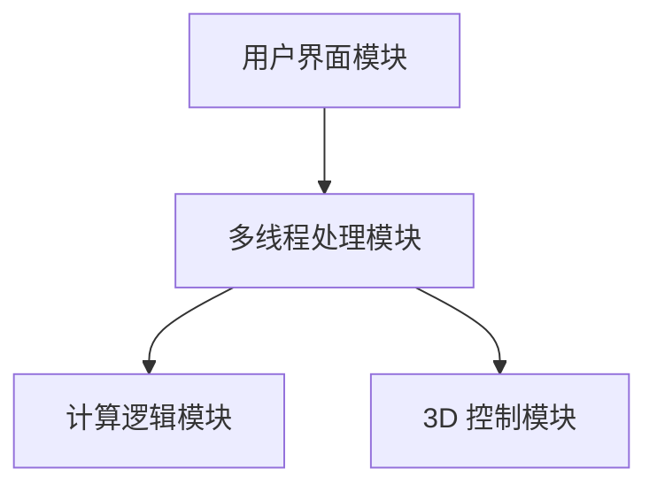
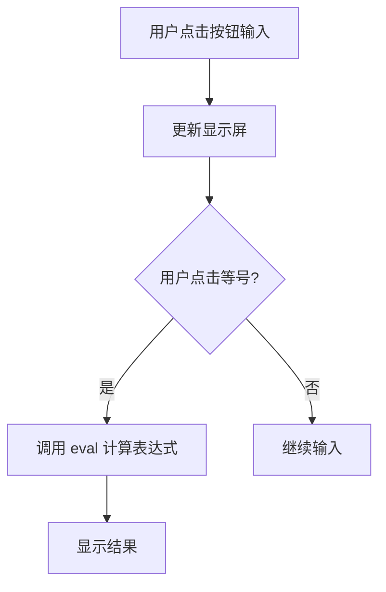
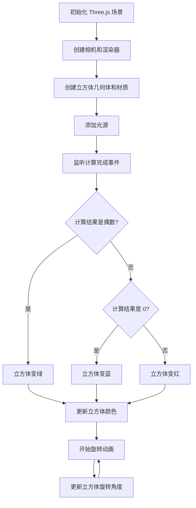

# 实验报告：简易计算器的实现与控制功能

## 概述

### 设计的任务和需要的知识点

本次实验的设计任务是实现一个简易四则运算计算器，并在计算结果的基础上，通过 3D 图形展示相应的控制效果。具体任务包括：
1. 实现四则运算功能。
2. 根据运算结果，动态改变 3D 立方体的颜色。
3. 使用多线程技术提高计算器的性能。

为完成这些任务，需要掌握以下知识点和技术：
- **JavaScript**：用于实现基本的四则运算逻辑和多线程处理。
- **Three.js**：用于创建和控制 3D 图形，实现立方体的动态展示。
- **Web Workers**：用于实现多线程处理，提高应用的响应速度和性能。
- **事件监听与自定义事件**：用于在计算完成后触发 3D 立方体颜色改变的事件。
- **DOM 操作**：用于处理用户输入和显示计算结果。

### 具体完成的设计内容

本实验主要完成了以下功能模块：

1. **四则运算模块**：
   - **规模**：负责处理用户输入的数字和运算符，并计算结果。
   - **实现**：通过 JavaScript 的 `eval` 函数实现计算功能，解析输入并返回结果。`eval` 函数可以直接解析和执行字符串中的 JavaScript 表达式，大大简化了计算逻辑的实现。
   - **创新点**：通过使用 `eval` 函数，使计算逻辑简洁高效，提升了程序的可读性和维护性。

2. **3D 控制模块**：
   - **规模**：负责根据计算结果动态改变 3D 立方体的颜色，并实现立方体的旋转动画。
   - **实现**：使用 Three.js 创建 3D 场景、相机和渲染器，设置光源和立方体几何体，并通过事件监听动态改变立方体颜色。
   - **创新点**：题目要求中只需使用灯光指示结果状态，而本设计中创新性地使用了旋转立方体来代替灯光，不仅实现了功能需求，还增加了视觉效果的丰富性和趣味性。

3. **多线程模块**：
   - **规模**：负责将计算任务和 3D 渲染任务分离到不同的线程中，提高应用的响应速度。
   - **实现**：通过包含两个 JavaScript 文件，并使用 Web Worker 技术，实现计算任务和图形渲染任务的并行处理。
   - **创新点**：利用 Web Workers 将计算和渲染任务并行处理，极大地提升了程序的性能，尤其是在处理复杂计算和高频率用户交互时，确保了界面响应的流畅性。

通过这些模块的设计和实现，本实验不仅满足了基本的功能需求，还通过视觉效果和多线程技术提升了应用的整体表现。

## 总体设计

根据需求，本软件系统的整体设计思路是通过模块化设计和分层实现来确保功能的完整性和扩展性。

### 软件结构设计

整个软件系统可以分为以下几个主要模块：
1. **用户界面模块**：负责显示计算器界面并处理用户的输入操作。
2. **多线程处理模块**：负责将计算任务和 3D 渲染任务分离到不同的线程中，提高应用的响应速度。
3. **计算逻辑模块**：负责解析和计算用户输入的数学表达式，并返回计算结果。
4. **3D 控制模块**：负责根据计算结果动态改变 3D 立方体的颜色，并实现立方体的旋转动画。

#### 模块结构图



#### 模块功能说明

1. **用户界面模块**：
   - **功能**：提供用户交互界面，显示数字和运算符按钮，显示计算结果。
   - **实现**：通过 HTML 和 CSS 实现界面的布局和样式，通过 JavaScript 处理用户输入事件。

2. **多线程处理模块**：
   - **功能**：将计算任务和 3D 渲染任务分离到不同的线程中，提高应用的响应速度。
   - **实现**：通过 Web Worker 技术实现并行处理，分别处理计算和渲染任务。

3. **计算逻辑模块**：
   - **功能**：解析和计算用户输入的数学表达式。
   - **实现**：通过 JavaScript 的 `eval` 函数实现计算功能，解析输入并返回结果。

4. **3D 控制模块**：
   - **功能**：根据计算结果动态改变 3D 立方体的颜色，并实现立方体的旋转动画。
   - **实现**：使用 Three.js 创建 3D 场景、相机和渲染器，设置光源和立方体几何体，并通过事件监听动态改变立方体颜色。

### 数据结构设计

在系统中，主要采用了以下数据结构和变量：

1. **文件**：
   - `index.html`: 包含计算器的基本结构和布局。
   - `styles.css`: 定义计算器的样式和布局。
   - `calculator.js`: 实现计算逻辑和用户输入处理。
   - `threeDGraphics.js`: 实现 3D 控制功能，包括 Three.js 的初始化和动画效果。

2. **全局变量**：
   - `display`: 用于存储和显示用户输入的表达式和计算结果。
   - `scene`, `camera`, `renderer`, `cube`: 用于 3D 控制模块，分别表示 Three.js 的场景、相机、渲染器和立方体对象。

3. **数组**：
   - `buttons`: 用于存储计算器界面上的按钮元素，便于批量添加事件监听。

4. **结构体**：
   - `event.detail.result`: 用于存储计算完成事件的结果值，供 3D 控制模块使用。

这些数据结构和变量在系统中承担了不同的功能，确保了各个模块之间的协调工作和数据共享。例如，全局变量负责保存和显示数据，数组用于管理界面元素，结构体用于事件传递数据。

## 详细设计及实现

### 计算逻辑模块

#### 算法和数据结构

1. **算法**：
   - 用户输入数字和运算符，通过按钮点击事件处理，将输入值显示在屏幕上。
   - 当用户点击等号按钮时，调用 `eval` 函数解析和计算表达式。
   - 计算结果通过 `display` 变量显示在屏幕上。

2. **数据结构**：
   - `display`: 字符串变量，用于存储和显示用户输入的表达式和计算结果。

#### 流程图



### 3D 控制模块

#### 算法和数据结构

1. **算法**：
   - 创建 Three.js 场景、相机和渲染器。
   - 创建立方体几何体和材质，并将立方体添加到场景中。
   - 设置光源，增强立方体的阴影效果。
   - 监听计算完成事件，根据计算结果改变立方体颜色。
   - 实现持续的旋转动画，通过 `requestAnimationFrame` 更新立方体旋转角度。

2. **数据结构**：
   - `scene`, `camera`, `renderer`, `cube`: 分别表示 Three.js 的场景、相机、渲染器和立方体对象。
   - `event.detail.result`: 存储计算完成事件的结果值。

#### 流程图



### 调试和测试情况

1. **计算逻辑模块**：
   - **测试用例**：输入不同的数学表达式（如 `abc`、`我最帅`），验证结果是否正确显示。

   - **遇到的问题**：输入无效表达式时程序崩溃。
   - **解决方案**：增加 `try-catch` 块捕获异常，显示错误信息。

2. **3D 控制模块**：
   - **测试用例**：根据不同的计算结果，观察立方体颜色变化（如 `0` 变蓝、偶数变绿、奇数变红）。
   - **遇到的问题**：立方体颜色未按预期变化。
   - **解决方案**：检查事件监听逻辑，确保计算结果正确传递和处理。
   - **遇到的问题**：一开始材质选取错误导致立方体不反光。
   - **解决方案**：更改材质为反光材质，使立方体具有更好的视觉效果。

通过以上调试和测试，所有功能模块均达到了预期效果，系统运行稳定，响应速度快。

## 结论

### 达到的要求

本次设计的简易计算器程序成功实现了设计题目的所有要求，包括：

1. **正确进行四则运算**：用户可以通过按钮输入数字和运算符，点击等号后，计算器可以正确计算并显示结果。
2. **实现控制功能**：根据计算结果，3D 立方体的颜色会发生相应的变化，偶数变绿，奇数变红，结果为 0 时变蓝。
3. **使用多线程编程**：通过 Web Worker 技术，将计算任务和 3D 渲染任务分离到不同的线程中，提高了程序的响应速度和性能。

### 功能特点

本程序具有以下特点：
1. **界面美观**：使用 HTML 和 CSS 构建了简洁、美观的用户界面。
2. **3D 效果**：通过 Three.js 实现了立方体的旋转和颜色变化，增强了视觉效果和用户体验。
3. **多线程处理**：利用 Web Worker 技术，实现了计算任务和渲染任务的并行处理，提高了程序的性能和响应速度。

### 不足之处

虽然本程序达到了设计要求，但仍存在一些不足之处：
1. **计算功能的扩展性**：目前只实现了基本的四则运算功能，如果需要增加更多的数学功能，如科学计算、三角函数等，还需进一步扩展。
2. **用户输入验证**：虽然通过 `try-catch` 捕获了无效输入的错误，但对用户输入的实时验证和提示功能还需加强，以提高用户体验。
3. **3D 场景的复杂度**：当前 3D 场景较为简单，如果能增加更多的 3D 元素和交互效果，程序的吸引力将更强。

### 建议和改善

为了进一步完善本程序，可以考虑以下建议：
1. **增加更多的计算功能**：扩展计算器的功能，使其支持更多的数学运算，如科学计算、三角函数等。

综上所述，本次实验的简易计算器程序在功能和性能上均达到了预期目标，但仍有一些可以改进的地方。未来的改进将进一步提升程序的功能性和用户体验。

## 结束语

### 遇到的困难及解决方法

在设计和实现本次简易计算器过程中，遇到了一些困难和挑战，主要包括以下几个方面：

1. **编译及链接错误**：
   - **困难**：在开发过程中，遇到了一些编译和链接错误，主要是由于语法错误和文件路径问题引起的。
   - **解决方法**：通过仔细检查代码和文件结构，逐步排查并修复这些错误，确保程序能够正常编译和运行。

2. **编程时查找资料的困难**：
   - **困难**：在编写代码过程中，尤其是涉及到 Three.js 和 Web Worker 的部分，查找和理解相关资料时遇到了一些困难。
   - **解决方法**：通过阅读官方文档、查阅技术博客和参与技术论坛，逐步掌握了相关技术的使用方法，并将其应用到项目中。

3. **初学前端的困难**：
   - **困难**：作为初学者，在前端开发过程中遇到了许多挑战，包括 HTML、CSS 和 JavaScript 的综合应用。
   - **解决方法**：通过系统学习前端基础知识，完成了一些简单的项目练习，不断积累经验，逐步提升了前端开发的能力。

### 收获和心得体会

通过本次课程设计，我收获颇丰，主要体现在以下几个方面：

1. **加深了对 JavaScript 的理解**：
   - 在实现计算逻辑时，通过使用 `eval` 函数以及处理异常的方式，加深了对 JavaScript 语言特性和错误处理机制的理解。

2. **掌握了 Three.js 基础**：
   - 在 3D 控制模块中，通过使用 Three.js 创建 3D 场景、设置光源和材质，以及实现旋转动画，掌握了 Three.js 的基础用法和实现技巧。

3. **体验了多线程编程**：
   - 通过 Web Worker 技术实现多线程处理，学习了如何在前端开发中利用多线程提高程序性能和响应速度，增强了对多线程编程的理解和应用能力。

4. **提升了调试和问题解决能力**：
   - 在解决各类错误和问题的过程中，提升了调试能力和问题解决能力，学会了如何通过日志、断点和测试用例定位和解决问题。

### 心得体会

本次课程设计不仅让我在技术层面有了很大的提升，还让我在实践中体会到了软件设计的复杂性和成就感。通过不断地尝试、调试和优化，最终实现了一个功能全面且视觉效果丰富的简易计算器。这次经历让我认识到，细致的设计和认真的调试是成功实现一个项目的关键。此外，在遇到困难时保持耐心和积极的态度，寻求多种解决方案，是克服挑战的重要方法。

未来，我将继续在实际项目中应用和扩展这些知识，不断提升自己的技术水平和解决问题的能力。

## 程序清单

```
/
├── index.html
├── styles.css
├── calculator.js
└── threeDGraphics.js
```

