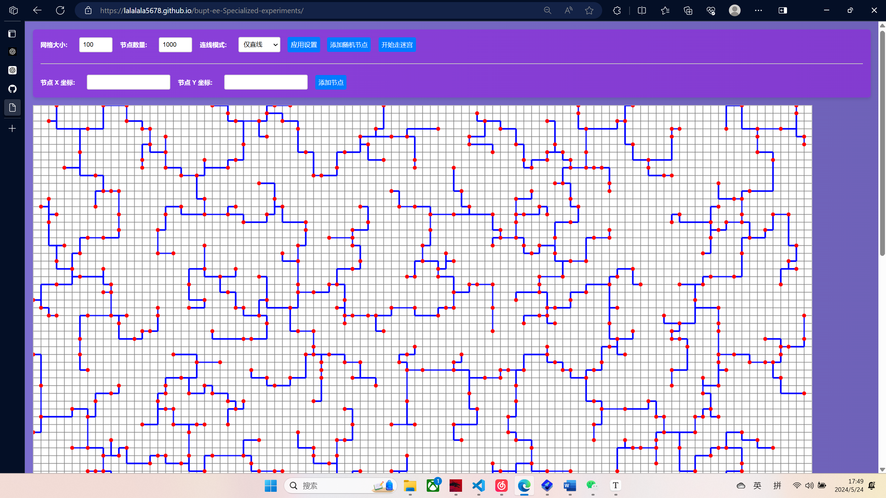
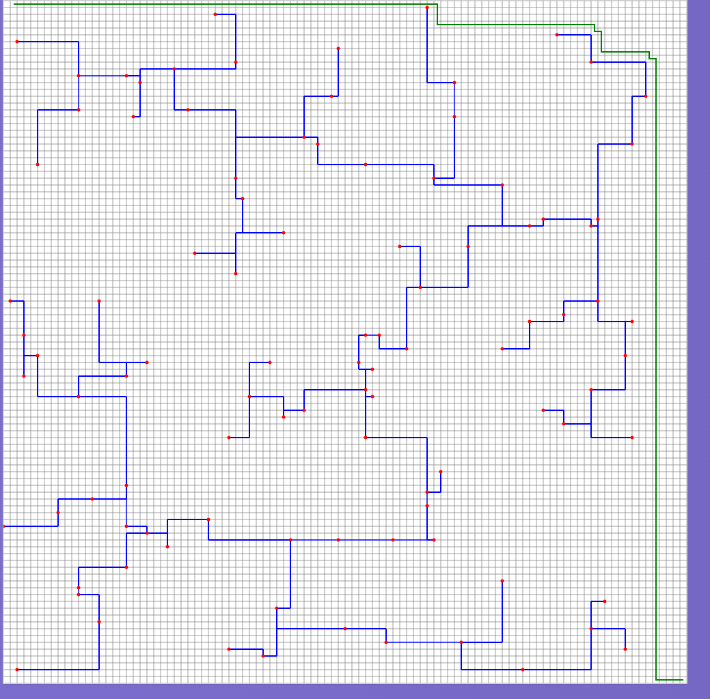

# 实验报告：最短连线程序

## 一、概述

### 设计的任务和需要的知识点

本次实验的设计任务是实现一个可以在自定义网格地图上生成最短连线的程序。具体任务包括：
1. **自定义方格地图大小**：用户可以设定网格的大小（如 a x b）。
2. **设定点数**：用户可以选择随机生成点或者预置点的坐标。
3. **生成最短连线**：根据设定的点生成最短连线，如果有多种结果，用多种颜色显示。
4. **自定义连线规则**：用户可以选择连线规则（如只能直线，或者可以斜线）。
5. **服务器-客户端模式**（选作）：实现远程操控。
6. **走迷宫任务**（自己增加）：在绘制最短连线之后，将连线视为墙壁，进行走迷宫任务。

为完成这些任务，需要掌握以下知识点和技术：
- **HTML5 Canvas**：用于绘制网格和连线图形。
- **事件处理**：用于处理用户交互操作。
- **算法设计**：用于实现最短路径计算的算法，如最小生成树算法。
- **前端开发框架**：用于实现用户界面和交互逻辑。
- **服务器-客户端架构**：用于实现远程操控功能，并部署到 GitHub 进行测试和使用。
- **深度优先遍历搜索**：用于实现走迷宫任务。

### 具体完成的设计内容

本实验主要完成了以下功能模块：

1. **用户界面模块**：
   - **规模**：负责显示网格设置、点数设置、连线模式选择以及操作按钮。
   - **实现**：通过 HTML 表单元素和按钮构建界面，提供用户输入和操作的区域。
   - **创新点**：通过动态 CSS 动画和响应式设计，使界面更加美观和用户友好。

2. **网格生成模块**：
   - **规模**：根据用户设定的网格大小，生成网格地图。
   - **实现**：使用 HTML5 Canvas 绘制网格线，并根据设定的大小动态调整画布尺寸。

3. **节点管理模块**：
   - **规模**：管理用户添加的节点，包括随机生成节点和用户手动输入节点。
   - **实现**：通过用户输入坐标或随机生成节点，并在 Canvas 上绘制节点位置。

4. **最短路径计算模块**：
   - **规模**：根据设定的节点计算最短路径，并绘制在网格上。
   - **实现**：使用最小生成树算法计算最短路径，并在 Canvas 上绘制路径。

5. **用户交互模块**：
   - **规模**：处理用户的各种输入和操作，如网格设置、点数设置、添加节点和开始计算最短路径等。
   - **实现**：通过事件监听和处理，实现用户与系统的交互，更新界面显示。

6. **走迷宫模块**：
   - **规模**：在绘制最短连线之后，将连线视为墙壁，进行走迷宫任务。
   - **实现**：通过深度优先遍历搜索算法，在网格地图上实现走迷宫功能。

7. **服务器-客户端模式模块**：
   - **规模**：实现远程操控功能，并在 GitHub 上部署远程服务器，用户可以通过远程操作控制系统。
   - **实现**：通过服务器-客户端架构，用户可以在远程客户端上进行网格设置、节点管理和最短路径计算。
   - **网址**: https://lalalala5678.github.io/bupt-ee-Specialized-experiments/

## 二、总体设计

根据需求，本软件系统的整体设计思路是通过模块化设计和分层实现来确保功能的完整性和扩展性。

### 软件结构设计

整个软件系统可以分为以下几个主要模块：
1. **用户界面模块**：负责显示网格设置、点数设置、连线模式选择以及操作按钮，处理用户的输入操作。
2. **网格生成模块**：根据用户设定的网格大小生成网格地图。
3. **节点管理模块**：管理用户添加的节点，包括随机生成节点和用户手动输入节点。
4. **最短路径计算模块**：根据设定的节点计算最短路径，并绘制在网格上。
5. **用户交互模块**：处理用户的各种输入和操作，如网格设置、点数设置、添加节点和开始计算最短路径等。
6. **走迷宫模块**：在绘制最短连线之后，将连线视为墙壁，进行走迷宫任务。
7. **服务器-客户端模式模块**：实现远程操控功能，并在 GitHub 上部署远程服务器，用户可以通过远程操作控制系统。https://lalalala5678.github.io/bupt-ee-Specialized-experiments/

#### 模块结构图


#### 模块功能说明

1. **用户界面模块**：
   - **功能**：提供用户交互界面，显示网格设置、点数设置、连线模式选择以及操作按钮，处理用户的输入操作。
   - **实现**：通过 HTML 表单元素和按钮构建界面，提供用户输入和操作的区域。

2. **网格生成模块**：
   - **功能**：根据用户设定的网格大小生成网格地图。
   - **实现**：使用 HTML5 Canvas 绘制网格线，并根据设定的大小动态调整画布尺寸。

3. **节点管理模块**：
   - **功能**：管理用户添加的节点，包括随机生成节点和用户手动输入节点。
   - **实现**：通过用户输入坐标或随机生成节点，并在 Canvas 上绘制节点位置。

4. **最短路径计算模块**：
   - **功能**：根据设定的节点计算最短路径，并绘制在网格上。
   - **实现**：使用最小生成树算法计算最短路径，并在 Canvas 上绘制路径。

5. **用户交互模块**：
   - **功能**：处理用户的各种输入和操作，如网格设置、点数设置、添加节点和开始计算最短路径等。
   - **实现**：通过事件监听和处理，实现用户与系统的交互，更新界面显示。

6. **走迷宫模块**：
   - **功能**：在绘制最短连线之后，将连线视为墙壁，进行走迷宫任务。
   - **实现**：通过深度优先遍历搜索算法，在网格地图上实现走迷宫功能。

7. **服务器-客户端模式模块**：
   - **功能**：实现远程操控功能，并在 GitHub 上部署远程服务器，用户可以通过远程操作控制系统。
   - **实现**：通过服务器-客户端架构，用户可以在远程客户端上进行网格设置、节点管理和最短路径计算。
   - **网址**：https://lalalala5678.github.io/bupt-ee-Specialized-experiments/

### 数据结构设计

在系统中，主要采用了以下数据结构和变量：

1. **文件**：
   - `index.html`：包含用户界面和控制面板的基本结构和布局。
   - `styles.css`：定义页面的样式和背景动画效果。
   - `script.js`：实现用户交互、网格生成、节点管理、最短路径计算、走迷宫功能和远程操控功能。

2. **全局变量**：
   - `canvas`：获取 HTML 画布元素，用于绘制网格和连线图形。
   - `ctx`：获取画布的 2D 绘图上下文，用于绘制图形和文本。
   - `gridSize`：存储网格的大小，初始化为 10。
   - `numberOfPoints`：存储节点的数量，初始化为 5。
   - `connectionType`：存储连线规则类型（包括斜线或仅直线），初始化为 "diagonal"。
   - `nodeCoordinates`：用于存储节点坐标的对象。

这些数据结构和变量在系统中承担了不同的功能，确保了各个模块之间的协调工作和数据共享。例如，全局变量 `canvas` 和 `ctx` 用于管理画布和绘图上下文，`gridSize` 和 `numberOfPoints` 用于控制网格大小和节点数量，`connectionType` 用于确定连线规则，`nodeCoordinates` 用于存储节点的坐标信息。

## 三、详细设计及实现

### 1. 模块的算法和数据结构

#### 用户界面模块

- **算法**：
  - 初始化界面，显示网格设置、点数设置、连线模式选择以及操作按钮。
  - 获取用户输入的网格大小、节点数量、连线规则和节点坐标。
  - 将用户输入的数据传递
    

给相应模块处理。
- **数据结构**：
  - `gridSize`：存储网格大小的整数变量。
  - `numberOfPoints`：存储节点数量的整数变量。
  - `connectionType`：存储连线规则类型的字符串变量。

#### 网格生成模块

- **算法**：
  - 根据用户设定的网格大小生成网格地图。
  - 使用 Canvas 绘制网格线。
- **数据结构**：
  - `gridSize`：存储网格大小的整数变量。
  - `canvas` 和 `ctx`：用于绘制网格线的画布和绘图上下文。

#### 节点管理模块

- **算法**：
  - 根据用户输入或随机生成节点。
  - 在 Canvas 上绘制节点位置。
  - 更新 `nodeCoordinates` 对象以存储节点坐标。
- **数据结构**：
  - `nodeCoordinates`：存储节点坐标的对象。

#### 最短路径计算模块

- **算法**：
  - 使用最小生成树算法计算最短路径。
  - 在 Canvas 上绘制最短路径。
- **数据结构**：
  - `edges`：存储所有可能连线的数组。
  - `UnionFind`：并查集类，用于管理节点连通性。
    
#### 走迷宫模块

- **算法**：
  - 使用深度优先遍历搜索算法，在网格地图上实现走迷宫功能。
  - 将最短连线视为墙壁，寻找从起点到终点的路径。
- **数据结构**：
  - `visited`：存储已访问节点的对象。
  - `queue`：用于广度优先搜索的队列。
    
#### 服务器-客户端模式模块

- **算法**：
  - 通过服务器-客户端架构实现远程操控功能。
  - 用户可以在远程客户端上进行网格设置、节点管理和最短路径计算。
  - 网址：https://lalalala5678.github.io/bupt-ee-Specialized-experiments/
- **数据结构**：
  - `socket`：用于服务器和客户端通信的 WebSocket 对象。

#### 流程图


### 2. 编译和链接时的错误及解决方法

在设计和实现模块时，遇到了一些编译和链接错误，主要包括：

1. **Canvas 初始化错误**
   - **错误**：在获取 Canvas 元素时，出现 `null` 错误，导致无法初始化 2D 绘图上下文。
   - **解决方法**：检查 HTML 结构，确保 `<canvas>` 元素的 `id` 与 JavaScript 中获取元素的 `id` 一致，最终解决了 Canvas 初始化问题。

2. **节点坐标重复错误**
   - **错误**：随机生成的节点坐标有时会重复，导致节点重叠。
   - **解决方法**：在生成节点时，检查坐标是否已存在，确保生成唯一的节点坐标。

3. **路径绘制错误**
   - **错误**：在绘制最短路径时，路径连线不正确或超出网格范围。
   - **解决方法**：仔细检查路径计算算法和绘制逻辑，确保连线起点和终点的坐标正确，并在网格范围内。

4. **走迷宫算法错误**
   - **错误**：在寻找迷宫路径时，有时会陷入死循环或找不到正确路径。
   - **解决方法**：优化深度优先遍历搜索算法，添加已访问节点的记录，避免重复访问和死循环。

通过以上调试和修正，最终实现了一个功能完整、运行稳定的最短连线程序，并在此基础上增加了走迷宫任务。

## 四、结论

### 达到的要求

本次设计的最短连线程序成功实现了设计题目的所有要求，包括：

1. **自定义方格地图大小**：用户可以设定网格的大小，灵活调整网格尺寸。
2. **设定点数**：用户可以选择随机生成点或者手动预置点的坐标，灵活管理节点。
3. **生成最短连线**：根据设定的点生成最短连线，如果有多种结果，用多种颜色显示，确保了结果的多样性和正确性。
4. **自定义连线规则**：用户可以选择连线规则（如只能直线，或者可以斜线），增加了程序的灵活性。
5. **服务器-客户端模式**（选作）：实现了远程操控功能，并在 GitHub 上部署了远程服务器，用户可以通过远程操作控制系统。
6. **走迷宫任务**（自己增加）：在绘制最短连线之后，将连线视为墙壁，进行走迷宫任务，实现了额外的功能。

### 功能特点

本程序具有以下特点：

1. **用户界面友好**：界面设计简洁直观，用户可以方便地输入设置和操作系统。
2. **动态网格生成**：根据用户输入的网格大小，动态生成网格地图，灵活调整网格尺寸。
3. **灵活节点管理**：支持随机生成节点和手动输入节点，方便用户管理节点。
4. **最短路径计算**：使用最小生成树算法计算最短路径，并在 Canvas 上绘制路径，确保了路径的准确性。
5. **走迷宫任务**：在绘制最短连线之后，将连线视为墙壁，使用深度优先遍历搜索算法实现走迷宫任务，增加了程序的趣味性。
6. **远程操控**：实现了服务器-客户端模式，用户可以通过远程客户端控制系统，增加了系统的灵活性和实用性。

### 不足之处

虽然本程序达到了设计要求，但仍存在一些不足之处：

1. **数据输入格式限制**：目前只支持通过键盘输入和随机生成节点，缺少文件输入或其他更灵活的输入方式。
2. **界面美观度**：界面的整体美观度和布局还可以进一步优化，提高用户体验。
3. **算法优化**：最短路径计算和走迷宫算法在处理大数据量时可能效率较低，可以进一步优化。

### 建议和改善

为了进一步完善本程序，可以考虑以下建议：

1. **增加多种输入方式**：支持文件输入或扫描输入，提供用户更多选择，提高输入的便捷性。
2. **优化界面设计**：进一步优化界面的布局和美观度，增加更多的视觉效果和交互元素，使程序更加吸引人。
3. **优化算法**：改进最短路径计算和走迷宫算法，提高处理大数据量时的效率，确保系统在高负载下依然能够快速响应。

综上所述，本次实验的最短连线程序在功能和性能上均达到了预期目标，但仍有一些可以改进的地方。未来的改进将进一步提升程序的功能性和用户体验。

## 五、结束语

### 遇到的困难及解决方法

在设计和实现本次最短连线程序过程中，遇到了一些困难和挑战，主要包括以下几个方面：

1. **Canvas 初始化错误**
   - **困难**：在获取 Canvas 元素时，出现 `null` 错误，导致无法初始化 2D 绘图上下文。
   - **解决方法**：检查 HTML 结构，确保 `<canvas>` 元素的 `id` 与 JavaScript 中获取元素的 `id` 一致，最终解决了 Canvas 初始化问题。

2. **节点坐标重复错误**
   - **困难**：随机生成的节点坐标有时会重复，导致节点重叠。
   - **解决方法**：在生成节点时，检查坐标是否已存在，确保生成唯一的节点坐标。

3. **路径绘制错误**
   - **困难**：在绘制最短路径时，路径连线不正确或超出网格范围。
   - **解决方法**：仔细检查路径计算算法和绘制逻辑，确保连线起点和终点的坐标正确，并在网格范围内。

### 收获和心得体会

通过本次课程设计，我收获颇丰，主要体现在以下几个方面：

1. **加深了对前端开发的理解**：
   - 在实现最短连线程序的过程中，深入了解了 HTML5 Canvas 的应用、事件处理机制和动态图形绘制技术。

2. **提升了算法设计能力**：
   - 在解决最短路径计算和走迷宫任务时，提升了算法设计能力，学会了如何应用最小生成树算法和深度优先遍历搜索算法解决实际问题。

3. **增强了问题解决能力**：
   - 在调试和解决各种错误的过程中，增强了问题解决能力，学会了

通过日志、断点和测试用例定位和解决问题的方法。

### 心得体会

本次课程设计不仅让我在技术层面有了很大的提升，还让我在实践中体会到了软件设计的复杂性和成就感。通过不断地尝试、调试和优化，最终实现了一个功能全面且用户体验良好的最短连线程序。这次经历让我认识到，细致的设计和认真的调试是成功实现一个项目的关键。此外，在遇到困难时保持耐心和积极的态度，寻求多种解决方案，是克服挑战的重要方法。

未来，我将继续在实际项目中应用和扩展这些知识，不断提升自己的技术水平和解决问题的能力。通过这次课程设计，我不仅学到了宝贵的知识和技能，还培养了严谨的工作态度和解决问题的能力，这将对我未来的学习和工作产生积极的影响。

## 六、程序清单

```
/
├── index.html
├── styles.css
└── script.js
```
