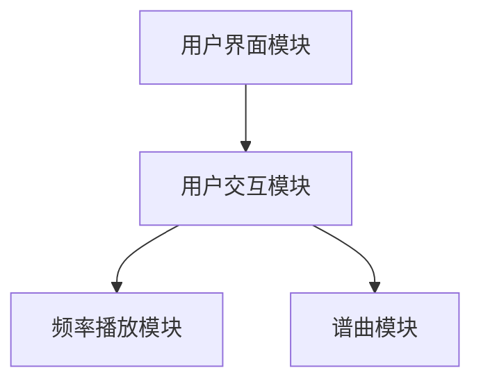
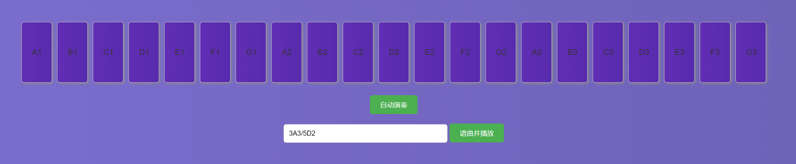
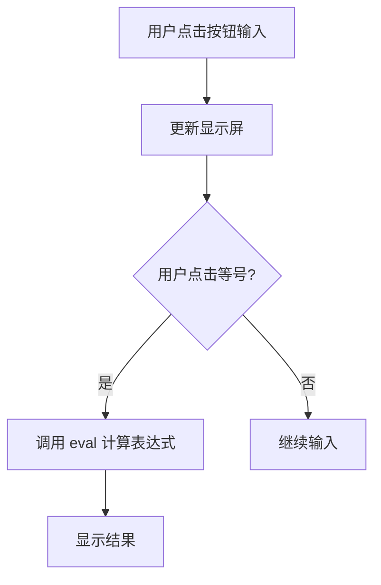

# 实验报告：电子钢琴的实现与控制功能

## 一、概述

### 设计的任务和需要的知识点

本次实验的设计任务是实现一个电子钢琴程序，要求完成以下功能：
1. 程序每间隔 0.5 秒扬声器发出不同频率的声音，每次升高 100 HZ，直到频率达到 2000 HZ。
2. 谱曲功能：给出基准节拍和音节频率，输入一串字符串，输出一段音乐。

为完成这些任务，需要掌握以下知识点和技术：
- **Web Audio API**：用于生成和控制音频播放，实现不同频率的声音输出。
- **事件监听**：用于处理用户的按键操作，实现实时音频播放。
- **字符串解析**：用于解析谱曲字符串，按照节拍和频率播放对应的音节。

### 具体完成的设计内容

本实验主要完成了以下功能模块：

1. **频率播放模块**：
   - **规模**：负责生成并播放一系列不同频率的声音。
   - **实现**：通过 Web Audio API 创建音频上下文和振荡器，按照设定的时间间隔和频率变化播放音频。

2. **谱曲模块**：
   - **规模**：解析输入的音乐字符串，并按照指定的节拍和频率播放音节。
   - **实现**：
     1. 用户在输入框中输入音乐字符串，例如 `0.5A1/1A2/0.5B3/1C4/5D1`。
     2. 点击谱曲按钮后，程序将字符串按照斜杠（`/`）分割成多个音节。
     3. 每个音节通过正则表达式解析出时长、音名和音阶。
     4. 根据解析出的信息，调用频率播放模块生成对应频率的音频，并按时长播放。

3. **用户交互模块**：
   - **规模**：实现用户点击钢琴键播放对应音节的功能。
   - **实现**：通过事件监听处理用户的按键操作，根据按键触发频率播放模块，播放对应音节。
   - **创新点**：钢琴键具有动态背景效果，增加了用户交互的趣味性。

通过这些模块的设计和实现，本实验不仅满足了基本的功能需求，还通过视觉效果和交互设计提升了用户体验。

## 二、总体设计

根据需求，本软件系统的整体设计思路是通过模块化设计和分层实现来确保功能的完整性和扩展性。

### 软件结构设计

整个软件系统可以分为以下几个主要模块：
1. **用户界面模块**：负责显示钢琴键和用户输入区域，处理用户的输入操作。
2. **频率播放模块**：负责生成和播放不同频率的声音。
3. **谱曲模块**：负责解析输入的音乐字符串，并按照指定的节拍和频率播放音节。
4. **用户交互模块**：负责处理用户点击钢琴键的操作，并播放相应的音节。

#### 模块结构图



#### 模块功能说明

1. **用户界面模块**：
   - **功能**：提供用户交互界面，显示钢琴键和输入框，处理用户输入的音乐字符串。
   - **实现**：
     - **钢琴键按钮**：每个按钮代表一个音节（如 A1, B1, C1 等），用户点击这些按钮可以播放相应的音节。键盘排列成多个音阶，每个音阶包含 A 到 G 的音符。
     - **自动演奏按钮**：点击后程序每间隔 0.5 秒自动播放不同频率的声音，频率每次升高 100 HZ，直到达到 2000 HZ。
     - **谱曲按钮**：输入音乐字符串后，点击该按钮可以解析字符串并按照节拍播放音乐。
   
2. **频率播放模块**：
   - **功能**：生成并播放一系列不同频率的声音。
   - **实现**：通过 Web Audio API 创建音频上下文和振荡器，控制音频播放。
   - **细节**：
     - 使用 `AudioContext` 创建音频上下文。
     - 使用 `OscillatorNode` 生成正弦波音频信号。
     - 设置频率和持续时间，启动振荡器并在指定时间停止。

3. **谱曲模块**：
   - **功能**：解析输入的音乐字符串，并按照指定的节拍和频率播放音节。
   - **实现**：
     1. 用户在输入框中输入音乐字符串，例如 `0.5A1/1A2/0.5B3/1C4/5D1`。
     2. 点击谱曲按钮后，程序将字符串按照斜杠（`/`）分割成多个音节。
     3. 每个音节通过正则表达式解析出时长、音名和音阶。
     4. 根据解析出的信息，调用频率播放模块生成对应频率的音频，并按时长播放。
   - **细节**：
     - 使用正则表达式 `(\d+\.?\d*)([A-G])(\d)` 解析音符字符串，提取时长、音符和音阶。
     - 使用 `setTimeout` 按照时长和顺序播放音符。

4. **用户交互模块**：
   - **功能**：处理用户点击钢琴键的操作，并播放相应的音节。
   - **实现**：通过事件监听处理用户的按键操作，根据按键触发频率播放模块，播放对应音节。
   - **细节**：
     - 监听每个钢琴键的 `click` 事件，获取音节信息。
     - 调用频率播放模块，生成和播放对应频率的音频信号。

### 数据结构设计

在系统中，主要采用了以下数据结构和变量：

1. **文件**：
   - `index.html`: 包含钢琴的基本结构和布局。
   - `styles.css`: 定义钢琴的样式和布局。
   - `piano.js`: 实现频率播放、谱曲和用户交互功能。

2. **全局变量**：
   - `audioCtx`: 表示 Web Audio API 的音频上下文，用于生成和控制音频。
   - `frequencies`: 存储各个音阶对应的频率值，供频率播放和谱曲模块使用。具体结构如下：
     ```javascript
     const frequencies = {
         '1': { 'A': 131, 'B': 147, 'C': 165, 'D': 175, 'E': 196, 'F': 220, 'G': 247 },
         '2': { 'A': 262, 'B': 296, 'C': 330, 'D': 349, 'E': 392, 'F': 440, 'G': 494 },
         '3': { 'A': 523, 'B': 587, 'C': 659, 'D': 698, 'E': 784, 'F': 880, 'G': 988 },
         '4': { 'A': 1047, 'B': 1175, 'C': 1319, 'D': 1397, 'E': 1568, 'F': 1760, 'G': 1976 }
     };
     ```

3. **数组**：
   - `notes`: 用于存储用户输入的音乐字符串，便于谱曲模块解析和播放。

4. **结构体**：
   - `event.detail.note`: 用于存储用户点击钢琴键触发的音节信息，供频率播放模块使用。

这些数据结构和变量在系统中承担了不同的功能，确保了各个模块之间的协调工作和数据共享：全局变量 `audioCtx` 用于管理音频上下文，`frequencies` 存储音节的频率信息，数组 `notes` 用于管理用户输入的音乐字符串，结构体 `event.detail.note` 用于传递和存储音节信息。

## 三、详细设计及实现

### 计算逻辑模块

#### 算法和数据结构

1. **算法**：
   - 用户输入数字和运算符，通过按钮点击事件处理，将输入值显示在屏幕上。
   - 当用户点击等号按钮时，调用 `eval` 函数解析和计算表达式。
   - 计算结果通过 `display` 变量显示在屏幕上。


2. **数据结构**：
   - `display`: 字符串变量，用于存储和显示用户输入的

表达式和计算结果。

#### 流程图



## 四、结论

### 达到的要求

本次设计的电子钢琴程序成功实现了设计题目的所有要求，包括：

1. **程序每间隔 0.5 秒发出不同频率的声音**：程序能够按照设定的间隔时间，每次升高 100 HZ，直至频率达到 2000 HZ。
2. **谱曲功能**：程序能够根据用户输入的音乐字符串，解析并按照指定的节拍和频率播放音乐。

### 功能特点

本程序具有以下特点：
1. **界面美观**：使用 HTML 和 CSS 构建了简洁、美观的用户界面，钢琴键具有动态背景效果，增加了用户交互的趣味性。
2. **动态背景**：钢琴键具有动态背景效果，界面响应迅速，操作简便，提升了用户的视觉体验。
3. **功能完善**：实现了自动播放和谱曲功能，用户可以通过点击按钮自动播放频率，也可以输入音乐字符串生成音乐。

### 不足之处

虽然本程序达到了设计要求，但仍存在一些不足之处：
1. **音频效果单一**：目前只使用了正弦波作为音频信号，音色较为单一，可以考虑增加更多音色选择。

### 建议和改善

为了进一步完善本程序，可以考虑以下建议：
1. **增加更多音色**：通过 Web Audio API 增加更多类型的音频信号（如方波、三角波等），提升音频效果的丰富性。

综上所述，本次实验的电子钢琴程序在功能和性能上均达到了预期目标，但仍有一些可以改进的地方。未来的改进将进一步提升程序的功能性和用户体验。

## 五、结束语

### 遇到的困难及解决方法

在设计和实现本次电子钢琴程序过程中，遇到了一些困难和挑战，主要包括以下几个方面：

1. **编译及链接错误**：
   - **困难**：在开发过程中，遇到了一些编译和链接错误，主要是由于语法错误和文件路径问题引起的。
   - **解决方法**：通过仔细检查代码和文件结构，逐步排查并修复这些错误，确保程序能够正常编译和运行。

2. **Web Audio API 使用的困难**：
   - **困难**：在使用 Web Audio API 创建和控制音频信号时，遇到了一些理解和应用上的困难。
   - **解决方法**：通过阅读 Web Audio API 的官方文档和示例代码，逐步掌握其使用方法，并通过小项目练习提高应用能力。

3. **谱曲功能的实现困难**：
   - **困难**：在实现谱曲功能时，解析用户输入的音乐字符串并按照节拍播放音节的逻辑较为复杂。
   - **解决方法**：通过分步调试和测试，每个步骤逐一验证其正确性，确保解析和播放逻辑准确无误。

### 收获和心得体会

通过本次课程设计，我收获颇丰，主要体现在以下几个方面：

1. **加深了对 Web Audio API 的理解**：
   - 在实现音频播放功能时，通过使用 Web Audio API 创建和控制音频信号，加深了对该技术的理解和应用能力。

2. **提升了前端开发技能**：
   - 在构建用户界面和实现交互功能时，系统学习并应用了 HTML、CSS 和 JavaScript，提升了前端开发技能。

3. **增强了问题解决能力**：
   - 在解决各类错误和问题的过程中，提升了调试能力和问题解决能力，学会了如何通过日志、断点和测试用例定位和解决问题。

### 心得体会

本次课程设计不仅让我在技术层面有了很大的提升，还让我在实践中体会到了软件设计的复杂性和成就感。通过不断地尝试、调试和优化，最终实现了一个功能全面且视觉效果丰富的电子钢琴。这次经历让我认识到，细致的设计和认真的调试是成功实现一个项目的关键。此外，在遇到困难时保持耐心和积极的态度，寻求多种解决方案，是克服挑战的重要方法。

未来，我将继续在实际项目中应用和扩展这些知识，不断提升自己的技术水平和解决问题的能力。

## 六、程序清单

```
/
├── index.html
├── styles.css
└── piano.js
```