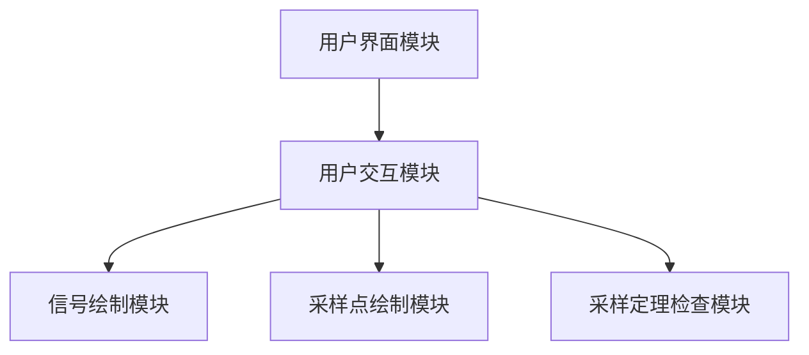
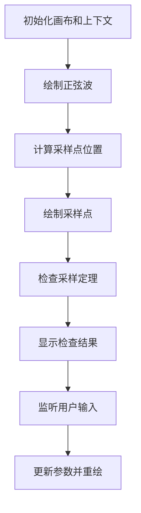
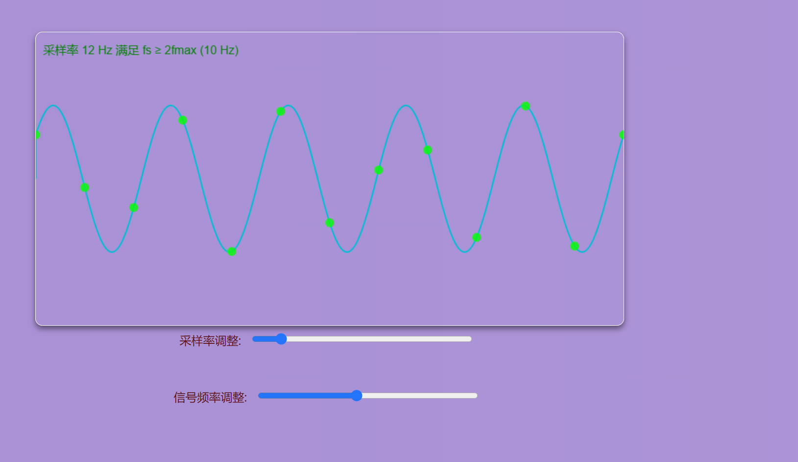
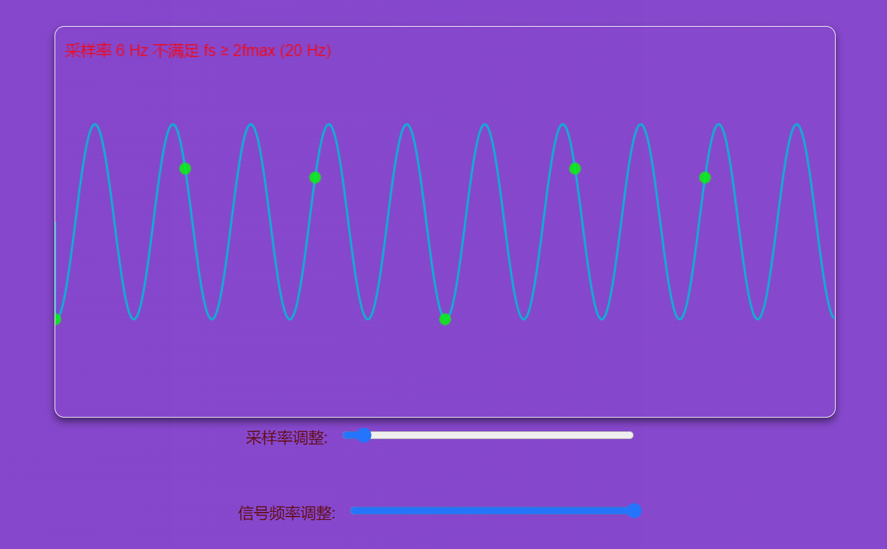

# 实验报告：采样定理动画演示

## 一、概述

### 设计的任务和需要的知识点

本次实验的设计任务是通过动画演示采样定理（包括香农采样定律和奈奎斯特采样定律），展示在不同采样率下信号的采样效果。具体任务包括：
1. 用动画描述两种情况：`fs ≥ 2fmax` 和 `fs < 2fmax`。
2. 通过调整采样率和信号频率，动态展示采样定理的应用效果。

为完成这些任务，需要掌握以下知识点和技术：
- **HTML5 Canvas**：用于绘制动画和图形。
- **采样定理**：理解采样定理的基本原理和应用场景。
- **CSS 动画**：用于美化界面和背景动画效果。
- **DOM 操作**：用于实现用户交互和事件处理。

### 具体完成的设计内容

本实验主要完成了以下功能模块：

1. **信号绘制模块**：
   - **规模**：负责绘制原始信号的连续波形。
   - **实现**：通过 `Canvas` 绘制正弦波形，使用 JavaScript 控制波形的频率和相位。

2. **采样点绘制模块**：
   - **规模**：根据用户设置的采样率绘制采样点。
   - **实现**：计算每个采样点的位置，并在波形上绘制这些点，使用颜色区分是否满足采样定理。

3. **采样定理检查模块**：
   - **规模**：检查当前设置的采样率是否满足采样定理。
   - **实现**：比较采样率和信号频率的关系，并在画布上显示结果，使用不同颜色提示用户当前状态是否满足 `fs ≥ 2fmax`。

4. **用户交互模块**：
   - **规模**：实现用户调整采样率和信号频率的功能。
   - **实现**：通过 HTML `input` 元素和事件监听器，实时获取用户输入并更新动画效果。

### 创新点

1. **动态背景效果**：通过 CSS 动画为页面增加动态背景效果，使演示界面更加美观和引人注目。
2. **实时动画展示**：结合用户输入，实时更新动画效果，直观展示采样定理在不同情况下的应用效果。

## 二、总体设计

根据需求，本软件系统的整体设计思路是通过模块化设计和分层实现来确保功能的完整性和扩展性。

### 软件结构设计

整个软件系统可以分为以下几个主要模块：
1. **用户界面模块**：负责显示画布和控制面板，处理用户的输入操作。
2. **信号绘制模块**：负责绘制原始信号的连续波形。
3. **采样点绘制模块**：根据用户设置的采样率绘制采样点。
4. **采样定理检查模块**：检查当前设置的采样率是否满足采样定理。
5. **用户交互模块**：实现用户调整采样率和信号频率的功能。

#### 模块结构图



#### 模块功能说明

1. **用户界面模块**：
   - **功能**：提供用户交互界面，显示画布和控制面板，处理用户输入的采样率和信号频率。
   - **实现**：通过 HTML 和 CSS 实现界面的布局和样式，通过 DOM 操作处理用户输入事件。
   - **元素**：
     - **画布**：用于绘制信号和采样点。
     - **控制面板**：包括采样率和信号频率的滑动条，用于调整参数。

2. **信号绘制模块**：
   - **功能**：绘制原始信号的连续波形。
   - **实现**：通过 `Canvas` 绘制正弦波形，使用 JavaScript 控制波形的频率和相位。
   - **细节**：使用 `beginPath` 和 `lineTo` 方法绘制正弦波，根据当前时间偏移实现动画效果。

3. **采样点绘制模块**：
   - **功能**：根据用户设置的采样率绘制采样点。
   - **实现**：计算每个采样点的位置，并在波形上绘制这些点，使用颜色区分是否满足采样定理。
   - **细节**：使用 `arc` 方法绘制采样点，通过循环计算每个采样点的位置。

4. **采样定理检查模块**：
   - **功能**：检查当前设置的采样率是否满足采样定理。
   - **实现**：比较采样率和信号频率的关系，并在画布上显示结果，使用不同颜色提示用户当前状态是否满足 `fs ≥ 2fmax`。
   - **细节**：通过 `fillText` 方法在画布上显示检查结果，使用条件判断设置文本颜色。

5. **用户交互模块**：
   - **功能**：实现用户调整采样率和信号频率的功能。
   - **实现**：通过 HTML `input` 元素和事件监听器，实时获取用户输入并更新动画效果。
   - **细节**：监听滑动条的 `input` 事件，获取用户输入的采样率和信号频率，更新全局变量并重绘画布。

### 数据结构设计

在系统中，主要采用了以下数据结构和变量：

1. **文件**：
   - `index.html`: 包含画布和控制面板的基本结构和布局。
   - `styles.css`: 定义页面的样式和背景动画效果。
   - `samplingTheorem.js`: 实现信号绘制、采样点绘制、采样定理检查和用户交互功能。

2. **全局变量**：
   - `canvas`: 获取 HTML 画布元素，用于绘制信号和采样点。
   - `ctx`: 获取画布的 2D 绘图上下文，用于绘制图形和文本。
   - `signalFrequency`: 信号频率，初始值为 5 Hz，用于控制正弦波的频率。
   - `samplingRate`: 采样率，初始值为 30 Hz，用于控制采样点的间隔。
   - `time`: 时间变量，用于动画效果的时间偏移。

这些数据结构和变量在系统中承担了不同的功能，确保了各个模块之间的协调工作和数据共享。例如，全局变量 `canvas` 和 `ctx` 用于管理画布和绘图上下文，`signalFrequency` 和 `samplingRate` 用于控制信号频率和采样率，`time` 用于实现动画效果的时间偏移。

## 三、详细设计及实现

### 1. 模块的算法和数据结构

#### 信号绘制模块

- **算法**：
  - 初始化画布和绘图上下文。
  - 使用 `Canvas` 的 `beginPath` 和 `lineTo` 方法绘制正弦波形。
  - 根据 `signalFrequency` 和 `time` 计算波形的相位偏移，实现动画效果。
- **数据结构**：
  - `signalFrequency`：控制正弦波的频率。
  - `time`：时间变量，用于实现动画效果。

#### 采样点绘制模块

- **算法**：
  - 根据 `samplingRate` 计算采样点的位置。
  - 使用 `Canvas` 的 `arc` 方法绘制采样点。
  - 通过循环计算每个采样点的位置，并绘制在画布上。
- **数据结构**：
  - `samplingRate`：控制采样点的间隔。

#### 采样定理检查模块

- **算法**：
  - 比较 `samplingRate` 和 `signalFrequency` 的关系。
  - 判断是否满足 `fs ≥ 2fmax`。
  - 使用 `fillText` 方法在画布上显示检查结果。
- **数据结构**：
  - `samplingRate`：控制采样率。
  - `signalFrequency`：信号频率。

#### 用户交互模块

- **算法**：
  - 监听 HTML `input` 元素的 `input` 事件。
  - 获取用户输入的采样率和信号频率。
  - 更新全局变量并重绘画布。
- **数据结构**：
  - `samplingRate` 和 `signalFrequency`：从用户输入中获取的值。

### 2. 流程图和运行界面抓图

#### 流程图



#### 运行界面抓图和描述



1. **初始化画布和上下文**
   - 在 `index.html` 中创建 `<canvas>` 元素。
   - 在 `samplingTheorem.js` 中获取画布元素和 2D 上下文。

2. **绘制正弦波**
   - 使用 `Canvas` 的 `beginPath` 和 `lineTo` 方法，根据 `signalFrequency` 和 `time` 绘制正弦波。

3. **计算采样点位置**
   - 根据 `samplingRate` 计算每个采样点的位置。

4. **绘制采样点**
   - 使用 `Canvas` 的 `arc` 方法在正弦波上绘制采样点。

5. **检查采样定理**
   - 比较 `samplingRate` 和 `signalFrequency` 的关系，判断是否满足 `fs ≥ 2fmax`。

6. **显示检查结果**
   - 使用 `fillText` 方法在画布上显示采样定理的检查结果，满足定理时显示绿色文字，否则显示红色文字。

7. **监听用户输入**
   - 在 HTML 中创建 `<input>` 元素，用于调整采样率和信号频率。
   - 监听 `input` 事件，获取用户输入的值并更新全局变量。

8. **更新参数并重绘**
   - 根据用户输入的值更新 `samplingRate` 和 `signalFrequency`，并重新绘制画布上的内容。

### 3. 编译和链接时的错误及解决方法

在设计和实现模块时，遇到了一些编译和链接错误，主要包括：

1. **画布初始化错误**
   - **错误**：在获取画布元素时，出现 `null` 错误，导致无法初始化 2D 上下文。
   - **解决方法**：检查 HTML 结构，确保 `<canvas>` 元素的 `id` 与 JavaScript 中获取元素的 `id` 一致。

2. **正弦波绘制错误**
   - **错误**：绘制的正弦波形状不正确，出现波形扭曲的现象。
   - **解决方法**：仔细检查正弦波的绘制算法，调整波形计算公式，确保频率和相位计算正确。

3. **采样点位置错误**
   - **错误**：采样点的位置计算错误，导致采样点绘制在错误的位置。
   - **解决方法**：调整采样点位置的计算方法，确保采样点与正弦波的交点正确对齐。

4. **用户输入监听错误**
   - **错误**：无法正确监听用户输入的 `input` 事件，导致采样率和信号频率无法更新。
   - **解决方法**：检查事件监听器的绑定方法，确保事件能够正确触发，并在事件处理函数中更新全局变量。

通过以上调试和修正，最终实现了一个功能完整、运行稳定的采样定理动画演示程序。

## 四、结论

### 达到的要求

本次设计的采样定理动画演示程序成功实现了设计题目的所有要求，包括：

1. **用动画描述采样定理**：程序通过动画展示了两种情况：`fs ≥ 2fmax` 和 `fs < 2fmax`，直观地演示了采样定理的基本原理。
2. **动态调整采样率和信号频率**：用户可以通过滑动条实时调整采样率和信号频率，程序根据用户的输入动态更新动画效果，展示采样点和原始信号的变化。

### 功能特点

本程序具有以下特点：
1. **实时动画展示**：通过 `Canvas` 和 JavaScript 实现的动画效果，可以实时展示采样定理在不同采样率和信号频率下的效果。
2. **用户交互友好**：提供了用户交互界面，用户可以通过滑动条方便地调整采样率和信号频率，直观地观察到采样点和原始信号的变化。
3. **动态背景效果**：通过 CSS 动画为页面增加了动态背景效果，使演示界面更加美观和引人注目。

### 不足之处

虽然本程序达到了设计要求，但仍存在一些不足之处：
1. **动画性能**：在较低的采样率和较高的信号频率下，动画可能会出现卡顿现象，影响用户体验。
2. **界面美观度**：尽管增加了动态背景效果，但界面的整体美观度和布局还可以进一步优化。

### 建议和改善

为了进一步完善本程序，可以考虑以下建议：
1. **优化动画性能**：通过优化绘图算法和减少不必要的重绘，提高动画的性能和流畅度，确保在各种采样率和信号频率下都能流畅运行。
2. **增强界面设计**：进一步优化界面的布局和美观度，增加更多的视觉效果和交互元素，使程序更加吸引人。
3. **增加更多演示内容**：在当前演示基础上，增加更多与采样定理相关的演示内容，例如反演信号、别样的采样策略等，丰富程序的教育功能和展示效果。

综上所述，本次实验的采样定理动画演示程序在功能和性能上均达到了预期目标，但仍有一些可以改进的地方。未来的改进将进一步提升程序的功能性和用户体验。

## 五、结束语

### 遇到的困难及解决方法

在设计和实现本次采样定理动画演示程序过程中，遇到了一些困难和挑战，主要包括以下几个方面：

1. **画布初始化错误**：
   - **困难**：在获取画布元素时，出现 `null` 错误，导致无法初始化 2D 上下文。
   - **解决方法**：检查 HTML 结构，确保 `<canvas>` 元素的 `id` 与 JavaScript 中获取元素的 `id` 一致，最终解决了画布初始化问题。

2. **正弦波绘制错误**：
   - **困难**：绘制的正弦波形状不正确，出现波形扭曲的现象。
   - **解决方法**：仔细检查正弦波的绘制算法，调整波形计算公式，确保频率和相位计算正确，最终实现了正确的正弦波绘制。

3. **采样点位置错误**：
   - **困难**：采样点的位置计算错误，导致采样点绘制在错误的位置。
   - **解决方法**：调整采样点位置的计算方法，确保采样点与正弦波的交点正确对齐，解决了采样点绘制的问题。

4. **用户输入监听错误**：
   - **困难**：无法正确监听用户输入的 `input` 事件，导致采样率和信号频率无法更新。
   - **解决方法**：检查事件监听器的绑定方法，确保事件能够正确触发，并在事件处理函数中更新全局变量，最终实现了正确的用户输入监听。

### 收获和心得体会

通过本次课程设计，我收获颇丰，主要体现在以下几个方面：

1. **加深了对采样定理的理解**：
   - 在实现采样定理动画演示的过程中，通过实际动手操作和演示，进一步加深了对采样定理（香农采样定律和奈奎斯特采样定律）的理解。

2. **提升了前端开发技能**：
   - 在构建用户界面和实现交互功能时，系统学习并应用了 HTML5 Canvas、CSS 动画和 DOM 操作，提升了前端开发技能。

3. **增强了问题解决能力**：
   - 在解决各类错误和问题的过程中，提升了调试能力和问题解决能力，学会了如何通过日志、断点和测试用例定位和解决问题。

### 心得体会

本次课程设计不仅让我在技术层面有了很大的提升，还让我在实践中体会到了软件设计的复杂性和成就感。通过不断地尝试、调试和优化，最终实现了一个功能全面且视觉效果丰富的采样定理动画演示程序。这次经历让我认识到，细致的设计和认真的调试是成功实现一个项目的关键。此外，在遇到困难时保持耐心和积极的态度，寻求多种解决方案，是克服挑战的重要方法。

未来，我将继续在实际项目中应用和扩展这些知识，不断提升自己的技术水平和解决问题的能力。

## 六、程序清单

### 文件结构

```
/
├── index.html
├── styles.css
└── samplingTheorem.js
```